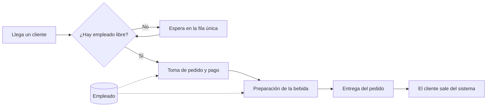

# Simulación de eventos discretos de una fila de atención en una cafetería de Belén Alameda (Medellín)

Proyecto de aula – Entrega 1 · Modelos y Simulación

---

## 1. Resumen

Este informe formula el problema de filas de espera en una cafetería de barrio de Belén Alameda (Medellín) y propone la arquitectura inicial de un modelo de simulación de eventos discretos para apoyar una decisión de capacidad. Durante las franjas pico, entre las 7:00 y 9:00 y entre las 12:00 y 14:00, la fila crece por encima de lo tolerable y parte de los clientes se retira sin comprar. La decisión que se quiere respaldar es evaluar si habilitar un segundo empleado en el punto de atención durante el pico reduce el percentil 90 del tiempo de espera por debajo de 5 minutos, sin que la utilización promedio del personal caiga por debajo del 60 %. El modelo representará la llegada de clientes, la fila única, la toma de pedido y pago, la preparación de la bebida y la entrega. Los datos se obtendrán mediante cronometraje in situ durante los picos y se complementarán con valores de la literatura para las distribuciones de llegada y servicio. El desempeño se medirá con cinco KPIs, entre ellos el tiempo de espera y la utilización del personal, que permitirán comparar los escenarios definidos.

## 2. Introducción

El consumo de café hace parte de la cultura diaria en Colombia y en ciudades como Medellín la cafetería de barrio es un punto de encuentro frecuente entre el hogar y el trabajo (Federación Nacional de Cafeteros de Colombia, 2023). En el sector residencial de Belén Alameda, varias cafeterías concentran su demanda en dos momentos del día: la salida de las casas hacia el trabajo y el descanso del mediodía. En esos momentos, con un solo punto de atención donde el mismo empleado toma el pedido, cobra y prepara la bebida, la fila puede crecer hasta seis u ocho personas y algunos clientes prefieren irse antes de ser atendidos.

El problema central es concreto y medible: durante las franjas pico el tiempo que un cliente espera en la fila supera con frecuencia los 8 minutos, cuando la expectativa del negocio es mantenerlo por debajo de 5. Esta espera prolongada genera clientes que se retiran sin comprar, ventas perdidas y una percepción de mal servicio que la literatura asocia directamente con insatisfacción y menor lealtad (Bielen y Demoulin, 2007; Davis y Vollmann, 1990).

La decisión que la simulación ayudará a tomar es operativa y de capacidad: saber si conviene pasar de uno a dos empleados en el punto de atención durante las franjas pico, y en cuál de ellas. Es una decisión de costos e ingresos, porque duplicar personal en un turno es un gasto fijo que solo se justifica si logra recuperar ventas perdidas. La teoría de colas clásica permite estimar métricas promedio en sistemas ideales (Gross, Shortle, Thompson y Harris, 2008; Hillier y Lieberman, 2010), pero no maneja con facilidad un servicio en dos etapas con tiempos variables y horarios discontinuos. La simulación de eventos discretos (DES) es el enfoque indicado porque representa, evento a evento, la llegada de clientes, la ocupación del empleado y la formación de la fila, y permite probar cambios de capacidad sin modificar el local real (Banks, Carson, Nelson y Nicol, 2010; Law, 2015; Robinson, 2014).

La pregunta principal de simulación es: *¿cómo cambian el tiempo medio y el percentil 90 de espera en la fila, y la utilización del personal, si se aumenta de uno a dos empleados el punto de atención durante la franja de la mañana y/o del mediodía?*

A partir de ella se plantean los escenarios iniciales de interés:

1. **Escenario base:** un empleado durante todo el día, que es la situación actual.
2. **Escenario A:** dos empleados solo en la franja de la mañana (7:00–9:00).
3. **Escenario B:** dos empleados solo en la franja del mediodía (12:00–14:00).
4. **Escenario C:** dos empleados en ambas franjas pico.
5. **Escenario de robustez:** la demanda del escenario base crece 20 % y se evalúa cuándo se satura el punto de atención.

Las preguntas de tipo "¿qué pasaría si...?" que acompañan estos escenarios son: ¿qué pasaría si solo se refuerza la mañana y no el mediodía?, ¿qué pasaría si el segundo empleado separara tareas (uno cobra y el otro prepara) en lugar de atender la misma fila?, y ¿qué pasaría si la demanda aumentara 20 % sin ampliar la capacidad?

En cuanto a los trabajos relacionados, la simulación de sistemas de servicio es un campo maduro. El marco metodológico se apoya en los textos clásicos de modelado y análisis de simulación (Law, 2015; Banks et al., 2010; Nelson, 2013) y en el uso práctico de modelos de eventos discretos para sistemas de filas (Kelton, Sadowski y Zupick, 2015; Robinson, 2014). La teoría de colas aporta las bases analíticas para entender el comportamiento límite de llegadas y servicios (Gross et al., 2008; Hillier y Lieberman, 2010). Para el componente de servicio, la evidencia muestra que el tiempo de espera percibido es una de las variables que más afecta la satisfacción y la intención de recompra en servicios (Bielen y Demoulin, 2007) y que las esperas cortas y predecibles mejoran la evaluación del servicio (Davis y Vollmann, 1990). Finalmente, el contexto del consumo de café en Colombia respalda la relevancia del sector (Federación Nacional de Cafeteros de Colombia, 2023). Estas referencias justifican por qué el problema es real, por qué la simulación es el enfoque adecuado y por qué los indicadores elegidos (medidos en la sección 4) son los pertinentes para la decisión.

## 3. Análisis del sistema

### 3.1. Frontera del sistema

El sistema modelado comienza cuando un cliente llega a la cafetería con intención de comprar y termina cuando recibe su pedido y sale. Quedan dentro del modelo los clientes, la fila única, el punto de atención donde se toma el pedido y se cobra, la preparación de la bebida y la entrega. La panadería y las bebidas listas se consideran disponibles de forma inmediata, por lo que no generan espera adicional.

Quedan fuera deliberadamente los elementos que no cambian la respuesta a la pregunta de capacidad:

- **La producción de panadería y alimentos:** se asume que llegan listos. Aunque exista atrás, su ritmo no determina la espera del cliente en la fila, que es el foco de la decisión.
- **Los pedidos por domicilio o plataformas:** representan una demanda separada que no ocupa la fila presencial.
- **Las mesas y el consumo dentro del local:** la decisión es sobre el punto de atención y la utilización del personal, no sobre el aforo del salón.
- **Factores externos:** el clima, las campañas de publicidad y el comportamiento de la competencia se tratan como condiciones dadas del entorno, no como variables del modelo.

Estas exclusiones simplifican el modelo sin sacrificar la información necesaria para responder si conviene agregar un segundo empleado en el pico.

### 3.2. Diagrama conceptual

La Figura 1 presenta el esquema conceptual del sistema. El cliente llega, se suma a la fila cuando el punto de atención está ocupado, y avanza por la toma de pedido y pago, la preparación de la bebida y la entrega. El empleado es el recurso compartido por las dos primeras actividades.

**Figura 1.** Diagrama conceptual del flujo de clientes en la cafetería.

El diagrama es consistente con la frontera definida: no aparecen actividades de producción de panadería, domicilios ni mesas. En la versión de referencia el modelo corresponde a una fila única atendida por un solo empleado; los escenarios A, B y C agregan un segundo empleado que atiende la misma fila, lo que reduce el tiempo de espera pero introduce la pregunta por su utilización.

### 3.3. Clasificación técnica del sistema

La Tabla 1 clasifica el sistema en los cuatro ejes solicitados y justifica cada decisión con el comportamiento observado en la cafetería.

**Tabla 1.** Clasificación técnica del sistema.

| Eje | Clasificación | Justificación |
| --- | --- | --- |
| Comportamiento temporal | Dinámico | El estado del sistema cambia con la hora del día: hay momentos sin fila y momentos con seis u ocho clientes esperando. Un modelo estático no capturaría los picos. |
| Incertidumbre | Estocástico | La llegada de clientes y la duración del servicio no son fijas; varían entre minutos y entre personas. Esa variabilidad es la causa de que algunas veces la fila crezca y otras no. |
| Representación del cambio | Discreto | Los únicos cambios relevantes ocurren en instantes puntuales: llega un cliente, inicia el servicio, termina el servicio, el cliente sale. No hay variables que evolucionen de forma continua, por lo que el enfoque DES es el adecuado. |
| Interacción con el entorno | Abierto | Entran clientes desde la calle y salen con su pedido a lo largo de todo el día. El sistema intercambia entidades con su entorno, así que no puede tratarse como un sistema cerrado. |

### 3.4. Arquitectura inicial del modelo

La arquitectura se organiza en cuatro grupos de elementos que conviene no confundir: las entradas son variables que cambian entre escenarios; los parámetros son valores fijos que configuran el modelo; las variables de estado describen la condición del sistema en cada instante; y las salidas son los resultados calculados al final de cada corrida.

**Tabla 2.** Entradas del modelo.

| Elemento | Significado | Unidad / escala | Relación con el problema |
| --- | --- | --- | --- |
| Tasa de llegada de clientes | Ritmo al que llegan clientes a la cafetería | Clientes por hora, por franja | Determina cuánta demanda debe absorber el punto de atención. Cambia entre franjas y escenarios. |
| Tiempo de toma de pedido y pago | Duración en que el empleado atiende y cobra | Minutos | Tiempo que el cliente ocupa al empleado y base del tiempo de servicio. |
| Tiempo de preparación de la bebida | Duración de preparar el pedido | Minutos | Segunda etapa que ocupa al empleado y define el tiempo total de servicio. |
| Mezcla de productos | Proporción de pedidos por tipo de bebida | Porcentaje | Afecta el tiempo de preparación porque no todas las bebidas tardan lo mismo. |

**Tabla 3.** Parámetros del modelo.

| Elemento | Significado | Unidad / escala | Relación con el problema |
| --- | --- | --- | --- |
| Número de empleados | Puntos de atención simultáneos en la simulación | Unidad (1 o 2) | Es la variable que cambia en los escenarios A, B y C. |
| Franja de refuerzo | Horario en el que el segundo empleado está disponible | Hora de inicio y fin | Define en qué momento del día cambia la capacidad del sistema. |
| Horario de operación | Horas en las que el modelo funciona | Hora del día | Limita el periodo de cada corrida y permite aislar los picos. |
| Umbral de espera tolerable | Límite de espera que el negocio considera aceptable | Minutos | Permite traducir los resultados en una conclusión sencilla: ¿se cumple o no? |

**Tabla 4.** Variables de estado del sistema.

| Elemento | Significado | Unidad / escala | Relación con el problema |
| --- | --- | --- | --- |
| Clientes en fila | Número de personas esperando a ser atendidas | Entero | Es la medida directa de la congestión que quiere reducir la decisión. |
| Empleado ocupado o libre | Estado del punto de atención en cada instante | Libre / ocupado | Permite calcular la utilización del personal, clave para saber si el segundo empleado se justifica. |
| Pedidos en preparación | Trabajos que el empleado tiene en la etapa de preparación | Entero | Captura el efecto de la segunda etapa sobre el tiempo de servicio. |
| Hora simulada | Reloj del modelo | Hora del día | Organiza los eventos y permite cortar la corrida en franjas. |

**Tabla 5.** Salidas del modelo.

| Elemento | Significado | Unidad / escala | Relación con el problema |
| --- | --- | --- | --- |
| Tiempo de espera en fila | Tiempo entre la llegada del cliente y el inicio de su atención | Minutos | Es el resultado principal de la decisión. |
| Tiempo total en el sistema | Desde la llegada hasta la entrega del pedido | Minutos | Complementa el tiempo de espera con la duración total del servicio. |
| Utilización del personal | Proporción del tiempo que el empleado estuvo ocupado | Porcentaje | Permite saber si el segundo empleado queda con trabajo suficiente o si el costo no se justifica. |
| Clientes atendidos | Número de clientes que terminan su compra en la corrida | Clientes por hora | Mide si la capacidad adicional realmente atiende más gente. |
| Longitud de la fila | Número de personas en fila a lo largo del tiempo | Clientes | Describe la congestión desde otra perspectiva y facilita comparar escenarios. |

## 4. Métricas de desempeño (KPIs)

Los KPIs se eligieron para comparar los escenarios de forma objetiva y están directamente conectados con la decisión: espera (el problema), utilización (el costo de la decisión) y atención (el beneficio de la decisión). La Tabla 6 los resume.

**Tabla 6.** KPIs del modelo.

| KPI | Definición | Fórmula o criterio de cálculo | Unidad | Población / periodo | Dirección deseada |
| --- | --- | --- | --- | --- | --- |
| Tiempo medio de espera en fila | Promedio del tiempo que los clientes esperan antes de ser atendidos | Suma de esperas ÷ número de clientes | Minutos | Todos los clientes de las franjas pico | Menor es mejor |
| Percentil 90 del tiempo de espera | Valor bajo el cual queda el 90 % de las esperas | Ordenar esperas y tomar el valor correspondiente al 90 % | Minutos | Todos los clientes de las franjas pico | Menor es mejor; objetivo < 5 min |
| Utilización promedio del personal | Porcentaje del tiempo que el personal está ocupado atendiendo | Tiempo ocupado ÷ tiempo disponible | Porcentaje | Cada empleado de la franja | Rango objetivo 60–90 % |
| Clientes atendidos por hora | Ritmo de salidas del sistema | Clientes servidos ÷ horas de la franja | Clientes/hora | Franja pico completa | Mayor es mejor |
| Longitud media de la fila | Promedio de personas esperando en un instante cualquiera | Suma de longitudes a lo largo del tiempo ÷ tiempo | Clientes | Franja pico completa | Menor es mejor |

El percentil 90 es el indicador que traduce la decisión en una regla clara: el negocio quiere que al menos 9 de cada 10 clientes en el pico esperen menos de 5 minutos. La utilización pone la otra cara de la moneda: si al duplicar el personal la utilización cae por debajo del 60 %, la mejora de la espera tendría un costo por hora que el negocio debe valorar. Como el sistema es estocástico, en entregas posteriores estos KPIs se resumirán con medias, percentiles e intervalos de confianza a partir de varias corridas, y no con una sola ejecución.

## 5. Modelado y gestión de datos

El modelo necesita dos tipos de información: cuántos clientes llegan por franja y cuánto dura cada etapa del servicio. Para obtenerla se propone un plan de recolección con observación directa, complementado con valores de la literatura.

**Plan de observación in situ (cronometraje):** durante tres días representativos (por ejemplo, martes, jueves y sábado, para capturar semana y fin de semana), se medirán en las franjas de 7:00–9:00 y 12:00–14:00: hora de llegada de cada cliente, tiempo hasta el inicio de su atención, duración de la toma de pedido y pago, duración de la preparación y tipo de bebida pedida. Un formato sencillo en tabla (papel o celular) es suficiente para registrar toda la muestra. A partir de estos datos se estimarán la tasa de llegada y las distribuciones de los tiempos de servicio de cada etapa.

**Valores de referencia iniciales (para el prototipo, no para concluir):** la literatura sobre filas tipo M/M/c asume llegadas que siguen un proceso de Poisson y tiempos de servicio exponenciales (Gross et al., 2008; Hillier y Lieberman, 2010). Como valores de arranque, para las primeras pruebas del modelo se usará una llegada media de entre 2 y 4 minutos en el pico y tiempos de servicio y preparación de entre 1 y 3 minutos cada uno, confirmando después con la observación real si estas suposiciones se sostienen.

La Tabla 7 organiza la información de los datos.

**Tabla 7.** Variables de datos, fuentes y valoración preliminar.

| Variable / dato | Fuente | Unidad | Cobertura | Calidad / riesgo |
| :--- | :--- | --- | :--- | :--- |
| Hora de llegada de clientes | Cronometraje in situ | Minuto | 3 días × 2 franjas | Riesgo de registrar solo el pico y sesgar hacia la hora más concurrida |
| Tiempo de toma de pedido y pago | Cronometraje in situ | Minutos | Misma cobertura | Puede variar según el empleado y la comodidad del cliente |
| Tiempo de preparación | Cronometraje in situ | Minutos | Misma cobertura | Depende del tipo de bebida; necesita la mezcla de productos |
| Tipo de bebida vendido | Registro de caja o anotación | Categoría | Histórico si el local lo conserva | Dificultad de acceso a los registros del negocio |
| Parámetros de llegada y servicio | Literatura (filas M/M/c) | Distribución | Referencial | Solo orienta las primeras corridas; no reemplaza los datos locales |

Las limitaciones reconocidas son: muestra pequeña (tres días), posible sesgo por elegir días muy ajetreados o muy tranquilos, y la dificultad de acceso a datos históricos de ventas del local. Por eso los datos reales se combinarán con valores de literatura y, en una entrega posterior, se comparará la distribución ajustada con la observada y se hará análisis de sensibilidad sobre la tasa de llegada.

## 6. Supuestos y simplificaciones

La Tabla 8 presenta los supuestos iniciales, por qué son razonables y cómo se revisarán después.

**Tabla 8.** Supuestos y simplificaciones del modelo.

| Supuesto | Justificación | Riesgo si no se cumple | Cómo se revisará después |
| --- | --- | --- | --- |
| Los clientes llegan siguiendo un proceso de Poisson, con tasa constante por franja | Es el modelo estándar de llegadas de personas en filas y simplifica la estimación | Puede no capturar oleadas repentinas dentro del pico | Comparar las llegadas observadas con la distribución teórica |
| Fila única con atención en orden de llegada (FIFO) | Es el comportamiento visible de la cafetería y evita reglas de prioridad | Si alguien salta turno, las esperas estimadas bajan para él y suben para otros | Verificar en la observación si el orden se respeta |
| Un solo empleado atiende ambas etapas en el escenario base | Es la configuración actual del negocio | Separa el tiempo de servicio en dos ocupaciones del mismo recurso | Contrastar con el cronometraje real |
| No se modelan clientes que se retiran (abandono) en la primera versión | El porcentaje observado es bajo y simplifica el diseño | Puede sobreestimar la cantidad de clientes atendidos | Incorporar el abandono si el cronometraje muestra una frecuencia relevante |
| La fila no tiene límite de capacidad | El local no restringe físicamente la formación de la fila | Esperas muy largas podrían reducirse por desistimiento de clientes | Monitorear si se alcanzan filas largas en el escenario de robustez |
| La panadería y las bebidas listas están disponibles de inmediato | No se estudia la producción, solo la atención | Distorsiona poco la espera si la reposición es constante | Confirmar durante la observación que no hay faltantes prolongados |

Estos supuestos se revisarán después de la primera recolección de datos; los que no resistan la comparación con la realidad se ajustarán o se convertirán en escenarios.

## 7. Referencias

Banks, J., Carson, J. S., Nelson, B. L., y Nicol, D. M. (2010). *Discrete-event system simulation* (5.ª ed.). Pearson Prentice Hall.

Bielen, F., y Demoulin, N. (2007). Waiting time influence on the satisfaction-loyalty relationship in services. *Managing Service Quality, 17*(2), 174–193. https://doi.org/10.1108/09604520710735182

Davis, M. M., y Vollmann, T. E. (1990). A framework for relating waiting time and customer satisfaction in a service operation. *Journal of Services Marketing, 4*(1), 61–69. https://doi.org/10.1108/EUM0000000002506

Federación Nacional de Cafeteros de Colombia. (2023). *El consumo de café en Colombia* [Informe institucional]. Federación Nacional de Cafeteros.

Gross, D., Shortle, J. F., Thompson, J. M., y Harris, C. M. (2008). *Fundamentals of queueing theory* (4.ª ed.). John Wiley & Sons.

Hillier, F. S., y Lieberman, G. J. (2010). *Introducción a la investigación de operaciones* (9.ª ed.). McGraw-Hill.

Kelton, W. D., Sadowski, R. P., y Zupick, N. B. (2015). *Simulation with Arena* (6.ª ed.). McGraw-Hill Education.

Law, A. M. (2015). *Simulation modeling and analysis* (5.ª ed.). McGraw-Hill Education.

Nelson, B. L. (2013). *Foundations and methods of stochastic simulation: A first course*. Springer.

Robinson, S. (2014). *Simulation: The practice of model development and use* (2.ª ed.). Palgrave Macmillan.